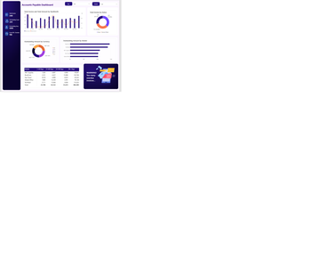
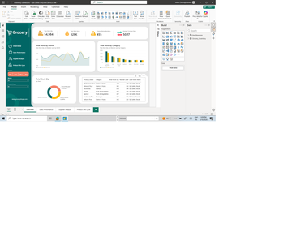
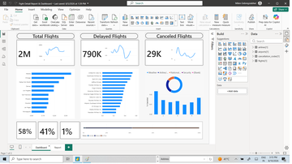
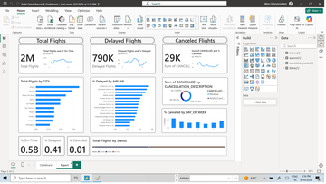
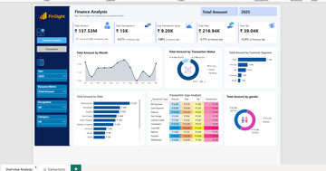
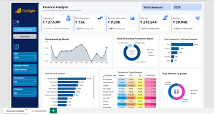

# Amanuel Gebreegziabhare — Data Analytics & Power BI Developer Portfolio

[](https://github.com/amanuelgebreegziabhare-maker/amanuel_gebreegziabhare) [](https://git-lfs.github.com)

Professional portfolio showcasing end-to-end analytics work: Power BI dashboards, SQL analyses, and Python EDA. Includes datasets, PBIX files, and certificates validating core skills.

## Recruiter summary

Data Analyst & Power BI Developer experienced delivering business-focused dashboards and analyses for finance, HR, and operations. Core skills: Power BI (DAX, Power Query), SQL, Python (pandas), data modeling, and storytelling. Available for analytics roles and contract work.

## Table of contents

- [Quick start](#quick-start)
- [Projects](#projects)
- [Technical skills & certificates](#technical-skills--certificates)
- [Contributing & notes](#contributing--notes)
- [Contact](#contact)

## Quick start

To preview the portfolio site locally (requires Node.js):

```bash
npm install
npm run dev
```

Visit the URL shown by Vite to browse project pages.

## Projects

Project folders include Power BI dashboards, PBIX files, datasets and per-project READMEs. See the `PowerBI-Projects/` directory for detailed project writeups.

### Key projects

| Project | Category | Tools | Link |
| --- | --- | --- | --- |
| Sales Performance Dashboard | Power BI |   | [Open project](PowerBI-Projects/Sales-Performance-Dashboard/README.md) |
| HR Attrition Analysis | Power BI |   | [Open project](PowerBI-Projects/HR-Attrition-Analysis/README.md) |
| Customer Segmentation (RFM) | Power BI |   | [Open project](PowerBI-Projects/Customer-Segmentation-RFM/README.md) |
| Account Payable Financial Analysis | Power BI |   | [Open project](PowerBI-Projects/Account%20Payable%20Financial%20Analysis/README.md) |
| Grocery Inventory Dashboard | Power BI |   | [Open project](PowerBI-Projects/Grocery%20Inventory%20Dashboard/README.md) |
| Flight Detail Report & Dashboard | Power BI |   | [Open project](PowerBI-Projects/Flight%20Detail%20Report%20%26%20Dashboard/README.md) |
| SQL Data Warehouse & Analytics Project | SQL / Data Engineering | SQL Server, ETL, Data Modeling, Data Warehouse | [Open Project](https://github.com/amanuelgebreegziabhare-warehouse-project2)
| SQL Project – Exploratory Data Analysis | SQL Analytics | SQL, EDA, Data Exploration | [Open Project](https://github.com/amanuelgebreegziabhare-maker/SQL-Project-Exploratory-Data-Analysis) |
| SQL Project – Advanced Data Analytics | SQL Analytics | SQL, Data Analysis, Business Intelligence | [Open Project](https://github.com/amanuelgebreegziabhare-maker/SQL-Project-Advanced-Data-Analytics) |


## Project gallery

Click a thumbnail to open the full-size screenshot.

[](PowerBI-Projects/Account%20Payable%20Financial%20Analysis/Accounts%20Payable%20Dashboard%20-%20Screenshot.png)  
[](PowerBI-Projects/Grocery%20Inventory%20Dashboard/Grocery%20Inventory%20Dashboard%20Screenshot.png)  
[](PowerBI-Projects/Flight%20Detail%20Report%20%26%20Dashboard/Flight%20Detail%20Dashboard%20-%20Screenshot.png)  

[](PowerBI-Projects/Flight%20Detail%20Report%20%26%20Dashboard/Flight%20Detail%20Report%20-%20Screenshot.png)  
[](PowerBI-Projects/Flight%20Detail%20Report%20%26%20Dashboard/Financial%20Analysis%20Complete%20Dashboard/Financial%20Analysis%20Dashboard%20Overall%20View%20Screenshot.png)  
[](PowerBI-Projects/Flight%20Detail%20Report%20%26%20Dashboard/Financial%20Analysis%20Complete%20Dashboard/Financial%20Analysis%20Dashboard%20Screenshot.png)

_Screenshots are stored in each project folder; thumbnails are generated in `assets/screenshots/thumbs`._


## Technical skills & certificates

Below are certificate files included in the `Certificates/` folder for quick verification. Filenames are URL-encoded so links work reliably on GitHub.

- Power BI:
  - [Get started with Microsoft Data Analytics (cert)](Certificates/Achievements%20-%20amanuelwtensay-1269%20_%20Microsoft%20Learn_Get%20started%20with%20Microsoft%20data%20analytics.pdf)
  - [Model Data with Power BI (cert)](Certificates/Achievements%20-%20amanuelwtensay-1269%20_%20Microsoft%20Learn_Model%20data%20with%20Power%20BI.pdf)
  - [Design Effective Reports in Power BI (cert)](Certificates/Achievements%20-%20amanuelwtensay-1269%20_%20Microsoft%20Learn_Design%20effective%20reports%20in%20Power%20BI.pdf)
  - [Manage and Secure Power BI (cert)](Certificates/Achievements%20-%20amanuelwtensay-1269%20_%20Microsoft%20Learn_Manage%20and%20Secure%20Power%20BI.pdf)
  - [Preparing Data for Analysis with Power BI (cert)](Certificates/Achievements%20-%20amanuelwtensay-1269%20_%20Microsoft%20Learn%20-%20Preparing%20Data%20for%20Analysis%20with%20Power%20BI.pdf)

- DAX:
  - [Use DAX in Semantic Models (cert)](Certificates/Achievements%20-%20amanuelwtensay-1269%20_%20Microsoft%20Learn_Use%20DAX%20in%20semantic%20models.pdf)

- Power Query / Data Preparation:
  - [Prepare and Visualize Data (cert)](Certificates/Achievements%20-%20amanuelwtensay-1269%20_%20Microsoft%20Learn_Prepare%20and%20visualize%20data%20with%20Microsoft.pdf)

- Microsoft Fabric / Data Ingestion:
  - [Ingest Data with Microsoft Fabric (cert)](Certificates/Achievements%20-%20amanuelwtensay-1269%20_%20Microsoft%20Learn%20-%20Injust%20Data%20with%20Microsoft%20Fabrics.pdf)

- Degree & Transcript:
  - [Bachelor Degree (image)](Certificates/My%20Bachelor%20Degree.jpg)
  - [Transcript (PDF)](Certificates/Transcript%20-%20amanuelwtensay-1269%20_%20Microsoft%20Learn.pdf)

- SQL Introduction to SQL – Simplilearn (cert):
  - [View Certificate](Certificates/Introduction-to-SQL-Simplilearn.pdf)


## Contributing & notes

- Add `node_modules/` to `.gitignore` to avoid committing dependencies. A `.gitignore` is present in this repo.
- Large binary files (PBIX, PDFs) are tracked with Git LFS. If you work locally, install Git LFS to fetch them correctly: `git lfs install`.

## Contact

- LinkedIn: https://www.linkedin.com/in/amanuelgebreegziabhare-4229953b9
- Email: amanuelgebreegziabhare@gmail.com

---

